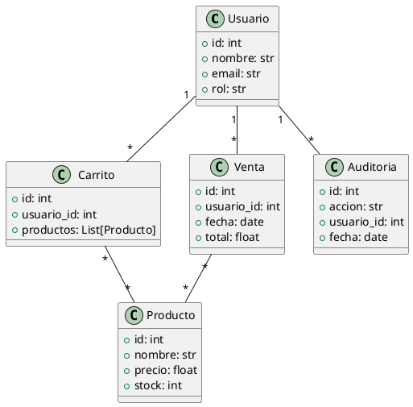

# 6. Diseño

## 6.1 Diseño arquitectónico

El sistema **TINGO VENTAS** adopta una arquitectura cliente-servidor, implementando el patrón **Modelo-Vista-Controlador (MVC)** para el backend. Esta arquitectura promueve la separación de responsabilidades, facilitando la escalabilidad, el mantenimiento y la evolución del sistema.

### Componentes principales:

- **Frontend**: Desarrollado con HTML, CSS y JavaScript, proporciona una interfaz de usuario interactiva y responsiva. Permite a los usuarios gestionar ventas, productos, usuarios y auditoría, comunicándose con el backend a través de peticiones HTTP (API REST).
- **Backend**: Construido en Python, estructurado bajo el patrón MVC. Expone una API RESTful y se encarga de la lógica de negocio, gestión de datos y seguridad. Incluye controladores, servicios, modelos, middlewares y utilidades.

La comunicación entre frontend y backend se realiza mediante endpoints definidos en el backend, asegurando una integración eficiente y segura.

---

## 6.2 Diseño del sistema (estructura de código)

El backend de **TINGO VENTAS** está organizado siguiendo la arquitectura **MVC (Modelo-Vista-Controlador)**, lo que permite una clara separación de responsabilidades y facilita la mantenibilidad del código. A continuación, se describe la estructura principal del código:

**Estructura de carpetas:**

```
backend/
│   config.py                # Configuración general del sistema
│   main.py                  # Punto de entrada de la aplicación
│   requirements.txt         # Dependencias del proyecto
│
├── controllers/             # Controladores: gestionan la lógica de las rutas y peticiones
│   ├── audit_controller.py
│   ├── auth_controller.py
│   ├── product_controller.py
│   └── role_controller.py
│
├── middlewares/             # Middlewares: lógica intermedia (autenticación, validaciones, etc.)
│   └── auth_middleware.py
│
├── models/                  # Modelos y esquemas de datos
│   └── schemas.py
│
├── routes/                  # Definición de rutas y endpoints
│   └── api.py
│
├── services/                # Servicios: lógica de negocio y acceso a datos
│   ├── audit_service.py
│   ├── auth_service.py
│   ├── product_service.py
│   ├── role_service.py
│   └── supabase_service.py
│
├── utils/                   # Utilidades y funciones auxiliares
│   └── jwt_utils.py
│
└── views/                   # Vistas (en este caso, respuestas de la API)
```

**Descripción de capas:**

- **Modelos**: Definen la estructura de los datos y validaciones (por ejemplo, `schemas.py`).
- **Vistas**: En el contexto de una API, corresponden a las respuestas que se envían al cliente.
- **Controladores**: Gestionan las peticiones, coordinan la lógica de negocio y devuelven las respuestas adecuadas.
- **Servicios**: Implementan la lógica de negocio y el acceso a fuentes de datos externas (bases de datos, servicios externos).
- **Middlewares**: Procesan las peticiones antes de llegar a los controladores (autenticación, autorización, validaciones).
- **Utilidades**: Funciones auxiliares reutilizables en distintas partes del sistema.

Esta estructura modular permite un desarrollo ágil, pruebas unitarias efectivas y una fácil incorporación de nuevas funcionalidades.

---

## 6.3 Diagrama de clases del sistema (PlantUML)

El siguiente diagrama de clases representa las principales entidades del sistema y sus relaciones. El código está listo para ser copiado y visualizado en PlantUML:



---

## 6.4 Prototipos

Los prototipos de la aplicación TINGO VENTAS abarcan las principales vistas y funcionalidades del sistema, permitiendo validar la experiencia de usuario antes de la implementación final. Las vistas prototipadas incluyen:

- **Login**: Pantalla de autenticación de usuarios, acceso seguro al sistema.
- **Dashboard**: Panel principal con resumen de ventas, métricas clave y accesos rápidos a los módulos principales.
- **Gestión de productos**: Interfaz para el alta, edición y eliminación de productos, visualización de inventario y control de stock.
- **Carrito de compras**: Visualización y gestión de productos seleccionados para la compra, cálculo automático de totales.
- **Gestión de usuarios**: Administración de usuarios, asignación de roles y permisos.
- **Tienda pública**: Vista orientada a clientes externos, permite la visualización de productos y la realización de compras.

Los prototipos están implementados en los archivos HTML y JavaScript dentro de la carpeta `frontend/`, asegurando una experiencia de usuario intuitiva, moderna y eficiente.